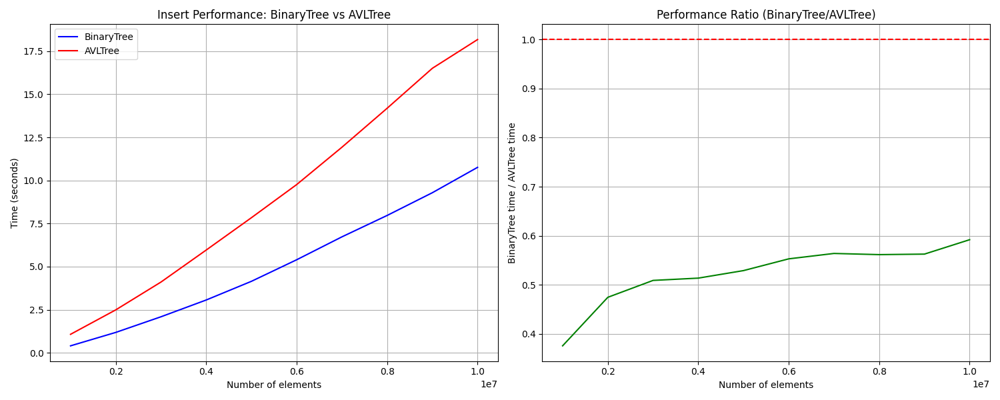
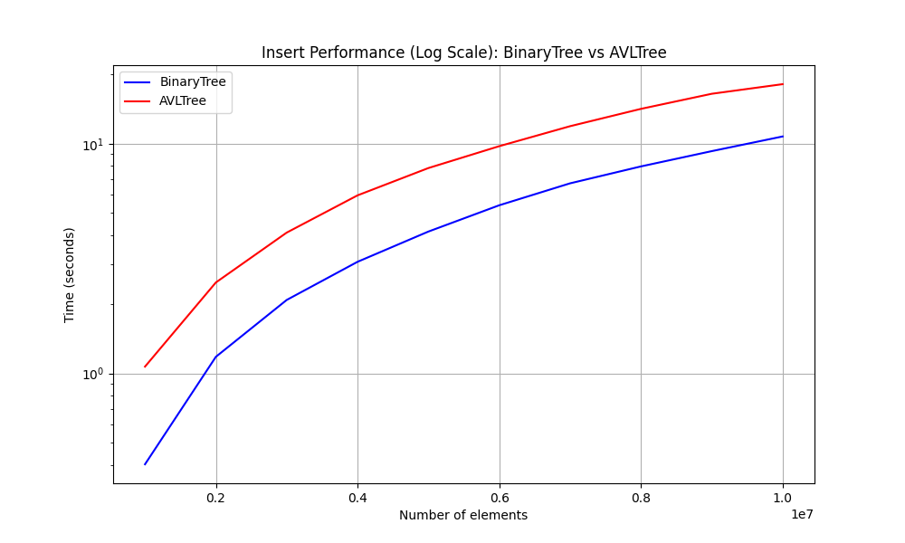
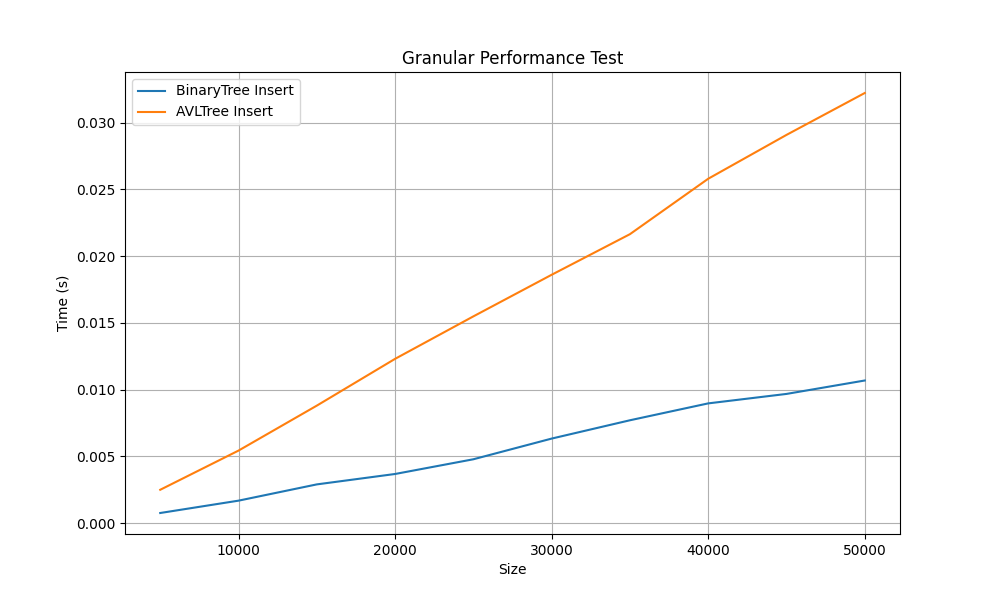
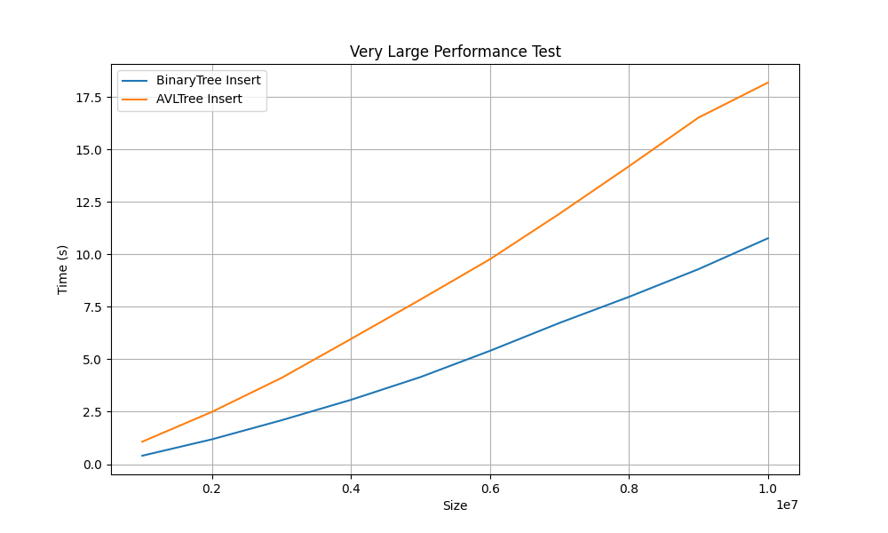

# Laboratory Work #4: Implementation and Testing of Trees

## Overview
This laboratory work focuses on implementing and testing abstract data types based on tree structures. The project includes implementations of a Binary Search Tree and an AVL Tree, along with performance testing and visualization.

## Project Structure
```
lab4/
├── CMakeLists.txt          # Build configuration for the project
├── build/                 # Build directory (ignored in .gitignore)
├── docs/                  # Documentation
│   └── ЛР-4.pdf           # Laboratory work description (in Russian)
├── impl/                  # Template class implementations (.tpp)
├── inc/                   # Header files (.hpp)
├── src/                   # Source code
│   └── main.cpp           # Main program file
├── tests/                 # Tests and performance analysis scripts
│   ├── performance_comparison.png  # Performance comparison graph
│   ├── performance_granular.csv    # CSV file with granular performance data
│   ├── performance_log_scale.png   # Logarithmic performance graph
│   ├── performance_small_large.csv # CSV file for small and medium tests
│   ├── performance_very_large.csv  # CSV file for large tests
│   ├── plot_performance.py         # Script for generating performance graphs
│   ├── test_avl_tree.cpp           # Tests for AVL Tree
│   ├── test_binary_tree.cpp        # Tests for Binary Tree
│   ├── test_performance.cpp        # Performance tests for small and medium datasets
│   ├── test_performance_big.cpp    # Performance tests for large datasets
│   └── ...                         # Other test files
├── types/                 # Custom data types
│   ├── complex.hpp        # Complex numbers
│   └── person.hpp         # Person data type
└── README.md              # Project documentation
```

## Features
### Implemented Data Structures
1. **Binary Search Tree**:
   - Operations: insertion, deletion, search.
   - Supports various data types (integers, strings, complex numbers, etc.).
   - Traversals: Preorder (NLR), Inorder (LNR), Postorder (LRN), and their variations.

2. **AVL Tree**:
   - Self-balancing tree with rotation operations.
   - Operations: insertion, deletion, search.
   - Supports various data types.

### Additional Operations
- **map**: Create a new tree by applying a transformation to each element.
- **where**: Filter nodes of the tree based on a condition.
- **reduce**: Aggregate tree elements into a single value using a specified rule.
- **Serialization and Deserialization**: Save the tree to a string and load it back.
- **Subtree Extraction**: Extract a subtree based on a specified root.
- **Subtree Search**: Check if a subtree exists within the tree.

## Testing
### Performance
Performance tests were conducted for the following dataset sizes:
- Small and medium datasets (10⁴ - 10⁵ elements).
- Large datasets (10⁶ - 10⁸ elements).

The results are saved in CSV files and visualized using the Python script `plot_performance.py`.

#### Example Graphs
1. **Insertion Performance Comparison**:

   

2. **Logarithmic Scale**:

   

3. **Granular Performance Test**:

   

4. **Very Large Performance Test**:

   

### Unit Tests
- Coverage of basic tree operations (insertion, deletion, search).
- Validation of tree traversals.
- Testing with custom data types (complex numbers, person objects).

## Build and Run
### Requirements
- **C++ Compiler**: Support for C++14 or later.
- **CMake**: Version 3.10 or later.
- **Python**: For visualizing results.
- **Google Test**: For running unit tests.

### Build Instructions
1. Clone the repository:
   ```bash
   git clone <repository-url>
   cd lab4
   ```
2. Create a build directory and navigate to it:
   ```bash
   mkdir build && cd build
   ```
3. Run CMake to configure the project:
   ```bash
   cmake ..
   ```
4. Build the project:
   ```bash
   make
   ```

### Running Tests
1. Navigate to the `build` directory:
   ```bash
   cd build
   ```
2. Run the test executable:
   ```bash
   ./tests
   ```
3. For large-scale performance tests, run:
   ```bash
   ./test_performance_big
   ```

### Visualizing Results
1. Ensure the required Python libraries are installed:
   ```bash
   pip install matplotlib pandas
   ```
2. Navigate to the `tests` directory:
   ```bash
   cd ../tests
   ```
3. Run the script to generate performance graphs:
   ```bash
   python plot_performance.py
   ```

## License
This project is licensed under the MIT License. See the `LICENSE` file for details.

## Acknowledgments
- **Google Test**: For providing a robust testing framework.
- **Matplotlib and Pandas**: For enabling data visualization.
