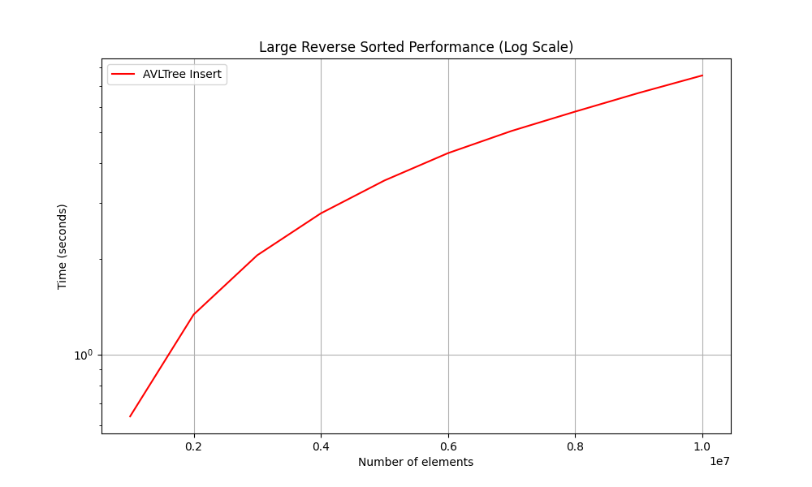
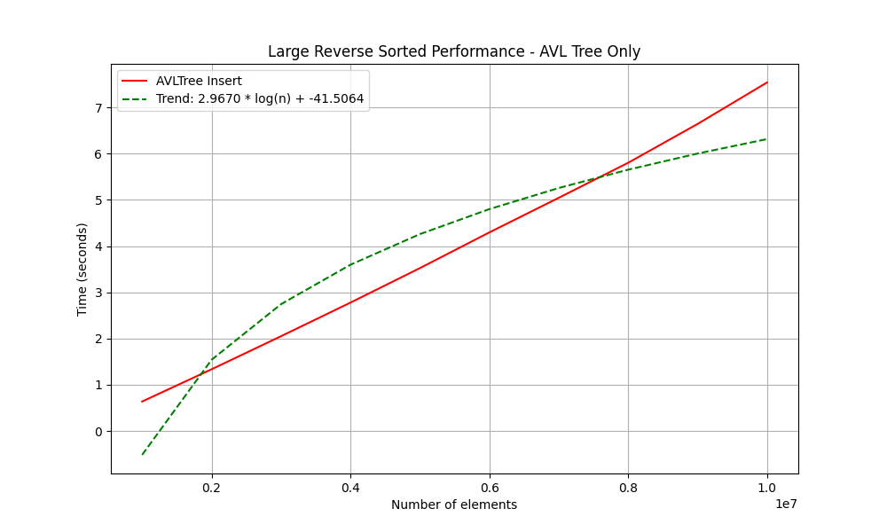

# Laboratory Work #4: Implementation and Testing of Trees

## Overview
This laboratory work focuses on implementing and testing abstract data types based on tree structures. The project includes implementations of a Binary Search Tree and an AVL Tree, along with performance testing and visualization.

## Project Structure
```
lab4/
├── CMakeLists.txt          # Build configuration for the project
├── build/                 # Build directory (ignored in .gitignore)
├── docs/                  # Documentation
│   └── ЛР-4.pdf           # Laboratory work description (in Russian)
├── impl/                  # Template class implementations (.tpp)
├── inc/                   # Header files (.hpp)
├── src/                   # Source code
│   └── main.cpp           # Main program file
├── tests/                 # Tests and performance analysis scripts
│   ├── performance_comparison.png  # Performance comparison graph
│   ├── performance_granular.csv    # CSV file with granular performance data
│   ├── performance_log_scale.png   # Logarithmic performance graph
│   ├── performance_small_large.csv # CSV file for small and medium tests
│   ├── performance_very_large.csv  # CSV file for large tests
│   ├── performance_sorted_insert.csv # CSV file for sorted data insertion
│   ├── small_sorted_comparison.csv # CSV file for small sorted data comparison
│   ├── medium_sorted_performance.csv # CSV file for medium sorted data
│   ├── large_sorted_performance.csv # CSV file for large sorted data
│   ├── large_reverse_sorted_performance.csv # CSV file for reverse sorted data
│   ├── plot_performance.py         # Script for generating performance graphs
│   ├── test_avl_tree.cpp           # Tests for AVL Tree
│   ├── test_binary_tree.cpp        # Tests for Binary Tree
│   ├── test_performance.cpp        # Performance tests for small and medium datasets
│   ├── test_performance_big.cpp    # Performance tests for large datasets
│   ├── test_sorted_performance.cpp # Performance tests for sorted data
│   └── ...                         # Other test files
├── types/                 # Custom data types
│   ├── complex.hpp        # Complex numbers
│   └── person.hpp         # Person data type
├── web/                   # Web visualization
│   ├── dist/              # Distribution files for GitHub Pages
│   ├── public/            # Public assets
│   └── src/               # Source code for web visualization
└── README.md              # Project documentation
```

## Features
### Implemented Data Structures
1. **Binary Search Tree**:
   - Operations: insertion, deletion, search.
   - Supports various data types (integers, strings, complex numbers, etc.).
   - Traversals: Preorder (NLR), Inorder (LNR), Postorder (LRN), and their variations.

2. **AVL Tree**:
   - Self-balancing tree with rotation operations.
   - Operations: insertion, deletion, search.
   - Supports various data types.

### Additional Operations
- **map**: Create a new tree by applying a transformation to each element.
- **where**: Filter nodes of the tree based on a condition.
- **reduce**: Aggregate tree elements into a single value using a specified rule.
- **Serialization and Deserialization**: Save the tree to a string and load it back.
- **Subtree Extraction**: Extract a subtree based on a specified root.
- **Subtree Search**: Check if a subtree exists within the tree.

## Testing
### Performance
Performance tests were conducted for the following dataset sizes:
- Small and medium datasets (10⁴ - 10⁵ elements).
- Large datasets (10⁶ - 10⁸ elements).
- Sorted datasets (ascending and descending order).

The results are saved in CSV files and visualized using the Python script `plot_performance.py`.

### Performance Analysis
Our tests revealed several important insights:

1. **Random Data**: For random data, both trees perform reasonably well, with the AVL tree being slightly slower due to the overhead of balancing operations.

2. **Sorted Data**: For sorted data, the AVL tree dramatically outperforms the regular binary tree:
   - At 50,000 elements, the binary tree is approximately 17,000 times slower than the AVL tree
   - The binary tree exhibits clear O(n²) behavior, while the AVL tree maintains O(n log n) complexity

3. **Search Operations**: AVL trees provide more consistent search times due to their balanced nature, especially for skewed data distributions.

4. **Memory Usage**: AVL trees require slightly more memory per node to store height information.

### Performance Graphs

#### Random Data Performance

1. **Standard Performance Comparison**:

   
   
   This graph shows the comparison of insertion times between Binary Tree and AVL Tree for random data. The AVL Tree shows slightly higher overhead due to balancing operations.

2. **Logarithmic Scale Performance**:

   
   
   The logarithmic scale better illustrates the complexity differences between the two tree implementations.

3. **Granular Performance Test**:

   
   
   More detailed performance measurements at smaller intervals show consistent behavior patterns.

4. **Very Large Performance Test**:

   
   
   Performance comparison with very large datasets (millions of elements) demonstrates how both trees scale.

#### Sorted Data Performance

5. **Sorted Data Performance**:

   
   
   This graph demonstrates the dramatic difference in performance when inserting sorted data, where binary trees degrade to O(n²) complexity.

6. **Sorted Insert Performance Comparison**:

   
   
   Detailed comparison of insertion times for sorted data shows the significant advantage of AVL trees.

7. **Sorted Insert Ratio**:

   
   
   This graph shows the ratio of Binary Tree time to AVL Tree time, highlighting how many times slower the Binary Tree becomes with sorted data.

8. **Sorted Insert Log Scale**:

   
   
   Logarithmic scale clearly shows the different complexity classes of the two implementations with sorted data.

#### Small Sorted Data Comparison

9. **Small Sorted Comparison**:

   
   
   Performance comparison with smaller sorted datasets shows that even at small sizes, the difference is significant.

10. **Small Sorted Ratio**:

    
    
    The ratio graph for small datasets shows how quickly the performance gap grows even with modest data sizes.

11. **Small Sorted Log Scale**:

    
    
    Logarithmic scale for small sorted datasets clearly demonstrates the complexity difference.

#### Medium and Large Sorted Data

12. **Medium Sorted Performance**:

    
    
    Performance with medium-sized sorted datasets (10⁴ to 10⁵ elements).

13. **Medium Sorted Log Scale**:

    
    
    Logarithmic scale for medium-sized sorted datasets.

14. **Medium Sorted Ratio**:

    
    
    Ratio of Binary Tree to AVL Tree performance for medium-sized sorted datasets.

15. **Large Sorted Performance**:

    
    
    Performance with large sorted datasets. For very large sizes, only AVL Tree measurements are shown as Binary Tree would take too long.

16. **Large Sorted Log Scale**:

    
    
    Logarithmic scale for large sorted datasets.

17. **Large Sorted Performance (AVL Only)**:

    
    
    Performance of AVL Tree with very large sorted datasets, with a trend line showing logarithmic complexity.

#### Reverse Sorted Data

18. **Large Reverse Sorted Performance**:

    
    
    Performance with large reverse-sorted datasets (descending order).

19. **Large Reverse Sorted Log Scale**:

    
    
    Logarithmic scale for large reverse-sorted datasets.

20. **Large Reverse Sorted (AVL Only)**:

    
    
    Performance of AVL Tree with very large reverse-sorted datasets, with a trend line showing logarithmic complexity.

### Unit Tests
- Coverage of basic tree operations (insertion, deletion, search).
- Validation of tree traversals.
- Testing with custom data types (complex numbers, person objects).

## Web Visualization
The project includes a web-based visualization of the tree structures using WebAssembly. The visualization is available at [https://alekhinalex.github.io/BinaryTree/](https://alekhinalex.github.io/BinaryTree/).

## Build and Run
### Requirements
- **C++ Compiler**: Support for C++14 or later.
- **CMake**: Version 3.10 or later.
- **Python**: For visualizing results.
- **Google Test**: For running unit tests.

### Build Instructions
1. Clone the repository:
   ```bash
   git clone <repository-url>
   cd lab4
   ```
2. Create a build directory and navigate to it:
   ```bash
   mkdir build && cd build
   ```
3. Run CMake to configure the project:
   ```bash
   cmake ..
   ```
4. Build the project:
   ```bash
   make
   ```

### Running Tests
1. Navigate to the `build` directory:
   ```bash
   cd build
   ```
2. Run the test executable:
   ```bash
   ./tests
   ```
3. For large-scale performance tests, run:
   ```bash
   ./test_performance_big
   ```
4. For sorted data performance tests, run:
   ```bash
   ./test_sorted_performance
   ```

### Visualizing Results
1. Ensure the required Python libraries are installed:
   ```bash
   pip install matplotlib pandas numpy
   ```
2. Navigate to the `tests` directory:
   ```bash
   cd ../tests
   ```
3. Run the script to generate performance graphs:
   ```bash
   python plot_performance.py
   ```

## License
This project is licensed under the MIT License. See the `LICENSE` file for details.

## Acknowledgments
- **Google Test**: For providing a robust testing framework.
- **Matplotlib and Pandas**: For enabling data visualization.
- **WebAssembly**: For enabling web-based visualization of tree structures.